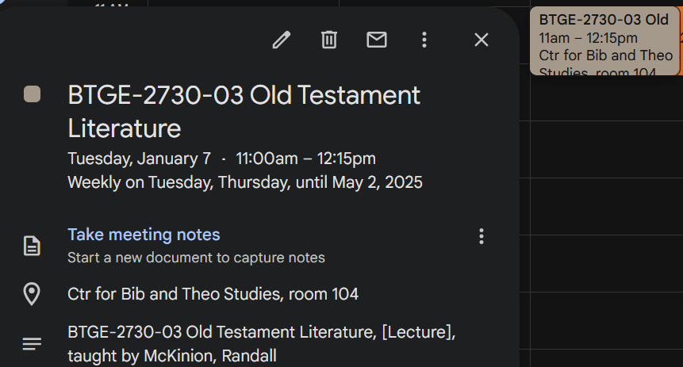
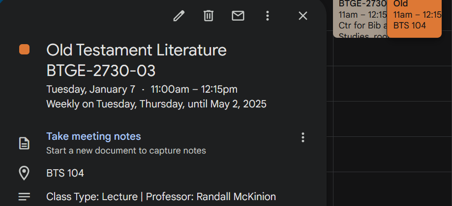

# Cedarcal-fmt

This is a tool for prettifying a Cedarville schedule iCalendar file (retrieved from [this page](https://selfservice.cedarville.edu/cedarinfo/info?schedule=1) with the download button).
Specifically, it prettifies it for Google Calendar.

The one issue you might run into is the mappings for buildings (I was only able to find values for buildings I've had classes in so far).
If you would like to add an acronym, just open an issue (or PR if you feel like it), and make sure to tell me the original building name from the ICS file.

## Installation & Usage

If this tool is used (star the repo!), I will begin to distribute it in a proper way, instead of this makeshift way, and provide a few options.

To install, clone the repository to your local machine and install with the following command:
```sh 
cargo build --release
cargo install --path .
```
Then, usage should be as easy as:
```sh 
cedarcal-fmt input_schedule.ics
```
Note, the executable can also be accessed at `./target/release/cedarcal-fmt`.

See `cedarcal-fmt --help` for more options.

## Examples

Original:



Prettified:


